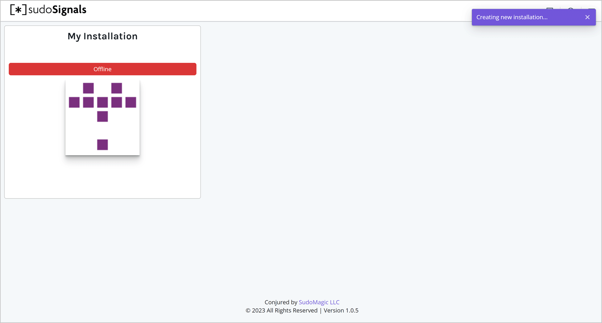
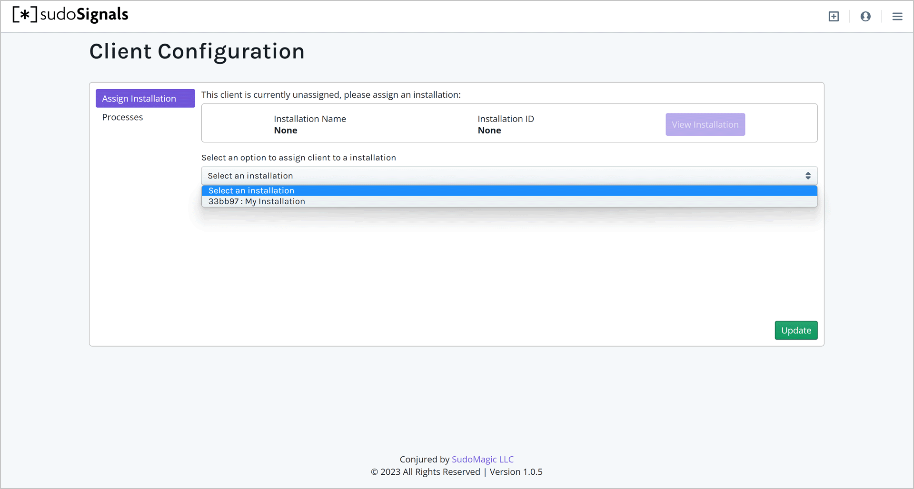
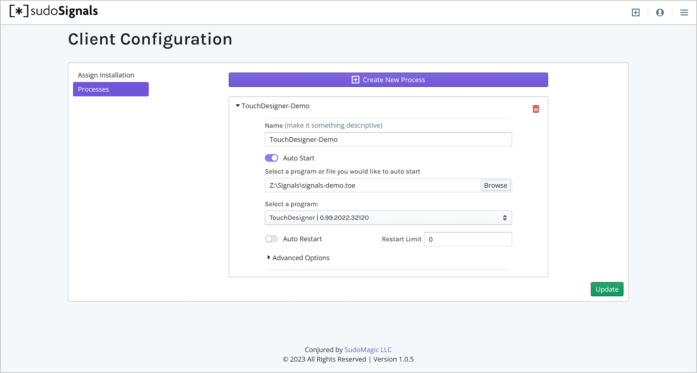
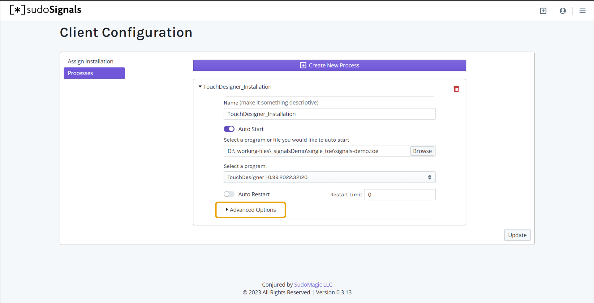

# Configure an Installation

sudoSignals runs as a local process on your Windows computer, and is controlled via an online web Dashboard.

## 1. Open the Dashboard

With an installation created, we can now configure how we'd like Signals to manage this machine. To get started, let's make sure that you have the Dashboard open in your browser — [dashboard.sudosignals.com](https://dashboard.sudosignals.com/)



## 2. Start sudoSignals

To configure the installation we'll also need sudoSignals running. From the shortcut on your desktop or from the start menu, start sudoSignals.

## 3. Configure from System Tray

Locate the sudoSignals icon in the system tray.


Right click on the system tray icon and select `Configuration`.


Alternatively, you can go to this page on your browser:  
`https://dashboard.sudosignals.com/configuration?p=10000`

```tip
While we use a webform to capture the configuration data, this page communicates directly with sudoSignals on port `10000` to create a configuration YAML file. 
```

## 4. Select Installation to Configure

On the Installation tab select which installation you would like to configure from the drop down menu. This process associates a Signals installation with your server.

Click `Update` and this will update the configuration YAML file and restart Signals on your computer. 




## 5. Go to the Startup Page

Navigate to the Startup tab on the Configuration page. Here we will configure Signals to start a application. 


## 6. Create a New Process

```tip
Applications that are controlled and monitored through sudoSignals are refereed to as `processes`. 
```

In order to add a new process to be monitored, click `Create New Process`.  

This creates a new process entry below:


```tip
You can open and close all of the parameters for a process by using the small carrot to the left of the process name.
```

### Assign a Signals Name

The `SIGNALS_NAME` is the unique name you'd like to associate with your process. You might choose to name this after the tookit you're using, or based on the work a given application is responsible for doing. 

```warning
It is important, however, that this name is unique. Each process managed by Signals should have a unique name. 
```


### Specify a file to open | **optional**

```tip
Setting a file is an optional field. If you have a built executable you'd like to open, Signals will just open that `.exe`. However, you can also specify a file you'd like that application to open. When using something like TouchDesigner this can be helpful.
```

If you have a specific file you'd like to run you can select that file first.  



For example, if I wanted to run a specific project file with TouchDesigner I would browse to the `TOE` file here..


```tip
Signals will attempt to find the right application to use to run your file - if you have multiple versions of this application installed, make sure that the correct version has been selected.
```

### Select a Program to Start

Next we'll select the application that Signals is going to start. Click the `Browse` button to select an application that Signals will start and stop. 

For example, if you are going to use sudoSignals to run TouchDesigner, you'll want to select `Browse` and navigate to the `TouchDesigner.exe` application.


```danger
If you're working with an executable built by Unreal Engine, you may need to take a few extra steps in your configuration. The `.exe` built by Unreal sometimes acts as a process starter that starts another executable. Be sure that you're targeting the correct `.exe` when using signals to be able to faithfully stop and start your process.
```

### Set Auto Restart Count

```tip
Signals can be configured to restart an application a fixed number of times, or to always attempt to keep an application running. 
```

If you'd like sudoSignals to keep your application running, first toggle the `Auto Restart` parameter to the ON position. 


To have Signals keep the application always running, leave the Restart Limit to 0. If you would only like Signals to restart an application a specific number of times, enter that number in the Restart Limit field. 

### Set Controlled Status

```tip
Controlled processes communicate through sudoSignals to the web. 
```

If you know that your application is going to have an exposed parameter that will need to talk to the web Dashboard, set the toggle for `Controlled` to the on position. If you only need Signals to start your application, and it doesn't need to talk with the Dashboard directly, you can leave this toggle in the OFF position.



## 7. Update

Now that we've gotten our installation configured, we can click `Update`. This will restart Signals, and in turn start any applications you've specified in your installation's configuration. 

## 8. Head to the dashboard

Back on the dashboard you should now see that signals is online

