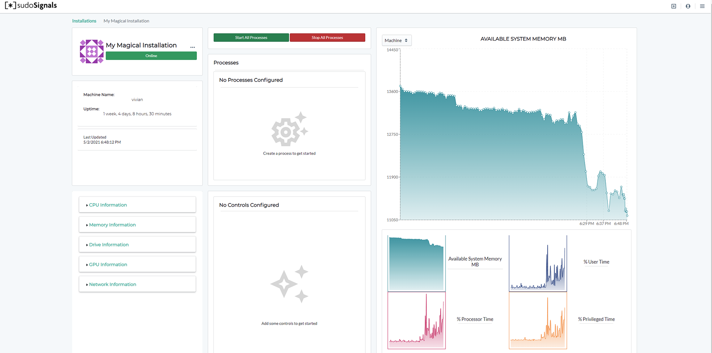

# Viewing Your Installation Stats

## 1. Open your dashboard

Back on the dashboard you should now see that signals is online

Clicking on your installation card will take you to the stats and control page for your installation.

## 2. See your machine stats

On the installation view page you'll see all of the reported information from your installation. On the left hand side of your screen you'll see critical information about the hardware and operating system for your installation.

Moving to the center column you'll see information directly related to your processes. Here you can start and stop the processes running on your installation. If you have a controlled installation, your remote operational controls will appear in the second card of this column.

On the right are the graphed reports from your installation. Key performance indicators (KPIs) are available at both the machine and process level. By default when opening an installation, the KPIs for your machine's will be displayed. These metrics are polled directly from the operating system. The mini graphs below the main graph allow you to select another KPI for inspection.

On the upper left hand corner of the main graph you can select to view the machine or process reports. Each process can also send metrics back to signals to be displayed in this graph.

