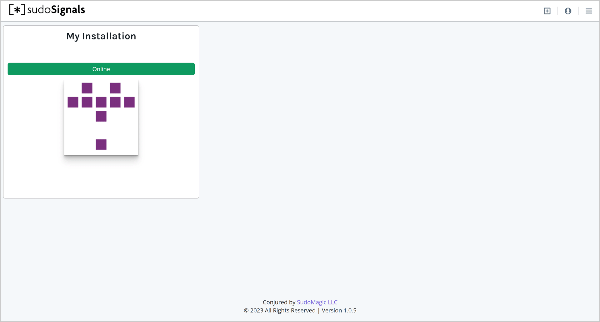
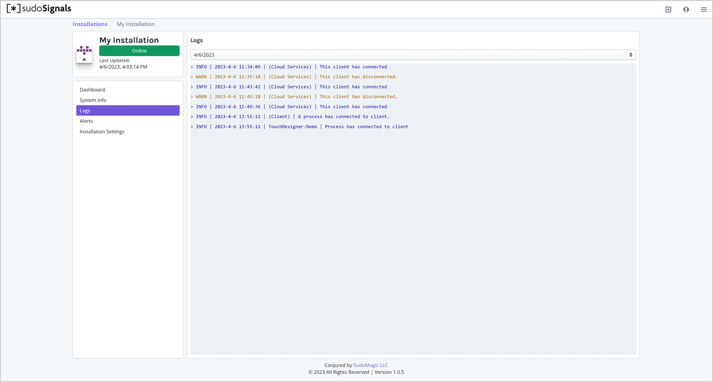
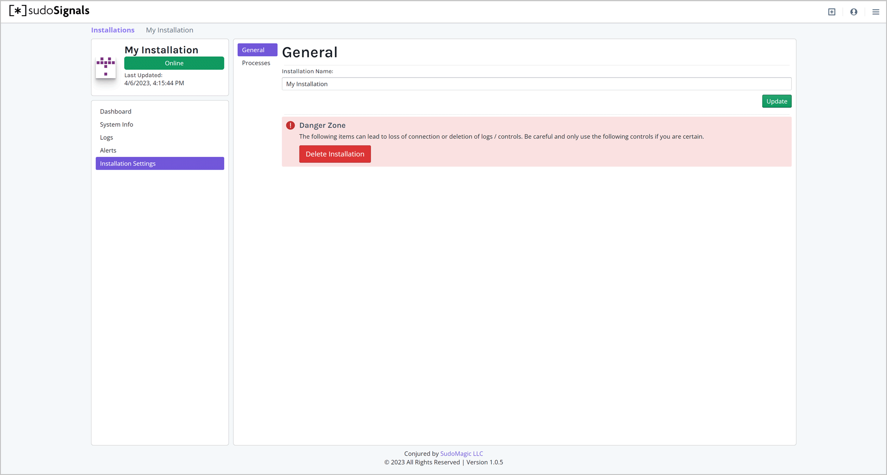
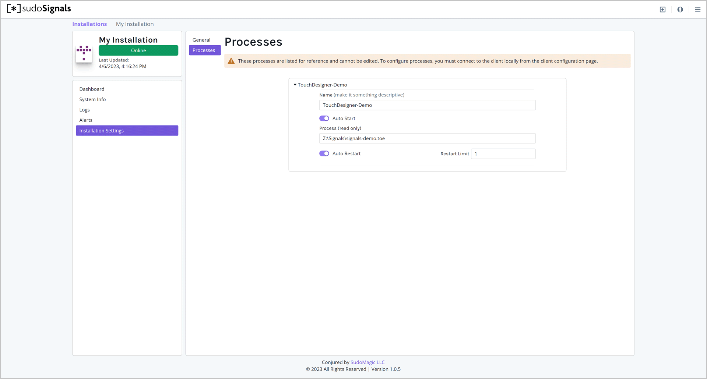

# Viewing Your Installation Stats

## 1. Installation Card View

Back on the Dashboard you should now see that Signals is online. From the card view you can see which installations are online, and their update and CPU Utilization at a glance.

Clicking on your installation card will take you to the stats and control page for your installation.




## 2. Installation Details

On the installation View page you'll see all of the reported information from your installation. On the left hand side of your screen you'll see a set of views you can toggle through for your installation. These include:
* Dashboard
* System Info
* Logs
* Alerts
* Installation Settings

Each of these views has a set of details to help you monitor and control your remote installation.


### Dashboard

The Dashboard is made up of three primary tiles:
* Processes
* Controls
* Graphs and Reports

These tiles are intended to provide you with quick access to all of the mission critical information you may require about your installation and its operation.


#### Processes
Processes is a tiled view of all processes that are communicating with the sudoSignals client on your installation machine. Installations information includes:
* Process Name
* Connection State
* Software & Software Version
* The number of restarts the process has experienced

Each process is represented as a small rectangular tile below the Start and Stop buttons. The Start All Processes and Stop All Processes buttons can be used to start or stop all Processes that sudoSignals is configured to `Auto Start`. This gives you the ability to remotely startup or shutdown the applications that are controlled by sudoSignals.

#### Controls
Controls can be accessed by using one of the [SudoMagic developed plugins](https://docs.sudosignals.com/002_plugins/), or by building your own controls by following the sudoSignals [service API](https://docs.sudosignals.com/004_api/). Depending on the environment, the [SudoMagic](https://www.sudomagic.com/) plugins are intended to be drag and drop solutions to fast integration with the sudoSignals dashboard. The TouchDesigner plugin, for example, lets you quickly mirror your controls from your TouchDesigner project in a web friendly format. Control schemas are pre-defined, and allow for your development team to focus on building compelling experiences rather than creating dashboard controls.

#### Graphs and Reports
On the right are graphed reports from your installation. Key performance indicators (KPIs) are available at both the machine and process level. By default, the KPIs for your machine's will be displayed. These metrics are polled directly from the operating system. The mini graphs below the main graph allow you to select another KPI for inspection. These graphs give you a quick view of your systems performance over time, allowing you to monitor your machine's performance remotely.

On the upper left corner of the main graph you can select to view the machine or Process reports. Each process can also send metrics back to Signals to be displayed in this graph. The used for graphs is available for download from the System Info view.


### System Info
System Information contains detailed information about the remote installation's hardware. These details can often be critical when trouble shooting performance issues, or determining if there may be a critical system issue. Hardware details in this view are reported directly from Windows [hardware discovery](https://pkg.go.dev/github.com/jaypipes/ghw). This view is comprised of:
* Machine Details  
* Installation Details
* Downloads
* Hardware Details
    * CPU Information
    * Memory Information
    * Drive Information
    * GPU Information
    * Network Information


#### Machine Details
Machine name, uptime, and last updated give you an at-a-glance view of the specific hardware you're monitoring. Uptime provides critical information on time since the last windows restart. Last updated is the time stamp since the last heartbeat from the sudoSignals client to the web dashboard.

#### Installation Details
Beyond information about Windows, it is often critical to have additional information about the installation. Included int he Installation Details are the Installation ID, Client Version, and Client Id.

```tip
If you ever experience issues with your installation, the support team at sudoSignals may ask you to provide information about the `Installation Id`, `Client Version`, or `Client Id`.
```

#### Downloads
Logs and Reports form your installation can be downloaded for your offline review. These logs can be especially useful if you want to review data that exists outside of the graphed view on the dashboard. Data is formatted as JSON. 

#### Hardware Details
Hardware details can provide additional insight into your local hardware. These details are broken into five additional categories:
* CPU Information
* Memory Information
* Drive Information
* GPU Information
* Network Information  

To see additional information for each category, use the carrot to expand the details.

### Logs

Logs provide additional insight into the performance of your installation beyond the time series data that's represented in graphs. Both the sudoSignals client and Processes can report messages to the sudoSignals dashboard to be displayed as logs. Logs are string based messages that are intended to be human readable. Logs have three different levels of importance:
* Info
* Warning
* Critical

Log messages are formatted as:  
`{log-level} | {time-stamp} | {reporting-process} | {log message}`



```warn
The current character limit for logs is 255.
```

### Alerts
sudoSignals can alert you via email or sms when there are critical issues with you installation. Signals can be configured to send an alert when:  
* Your installation goes offline. This may be due to a power outage, a compute restart, or an interruption in internet connectivity
* Your process goes offline. It's often valuable to know if your application has crashed, and sudoSignals can alert you if this happens.


```tip
When sudoSignals is set to Auto Restart your process, it will restart your application even if it crashes. When process alerts are enabled, you may still get a notification that your process has fallen offline so that you can investigate at your earliest convenience.
```

### Installation Settings
Installation settings includes the controls for updating details about your installation. From this view you can change the name of your installation or delete it from your account.



You can additionally view a read-only version of the settings assigned to your remote process by clicking on the process tab.

