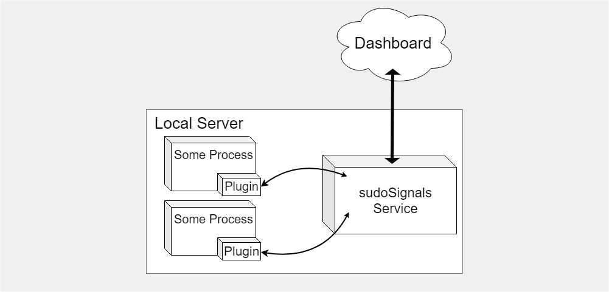

# Service API

sudoSignals has an open websocket API for controlling and reporting on process behavior. The sudoSignals Service is reponsible for starting processes on the local server, reporting system dianostic information, and relaying information and control settings between the dashboard and the plugins embedded in the monitored processes.  



## Service Connections
A plugin can connect to the sudoSignals Service via a websocket connection. This connection port is defined in the configuration for the service. The default settings open a websocket connection at `ws://localhost:80`. 
```warning
For security of your project and processes, only plugin connections from the local machine will be accepted. 
```


## Packet Structure
Websocket messages are sent as text formatted with JSON. They will follow this structure:
```json
{
	"action": <string>, 	// Action type
	"data": <map>, 			// Data relating to that action (report metrics, controls, etc)
	"identifier": <string>	// Identifying the process sending the packet. 
}
``` 

## Actions
sudoSignals defines a number of different actions that can be used in communication between the Plugin and the Service.

| Action			| Descriptor 	|
| --------------	| ------------- |
| `Start`			| Sent by Signals Service on connection to confirm connection is open. |
| `identify` 		| Sent by Plugin to give information about process and identify connections for monitoring.	|
| `report` 			| Sent by Plugin to update reports in dashboard. |  
| `control-Set` 	| Sent by Plugin to update current state of controls that are available for remote control. |
| `control-Update` 	| Sent by Signals Service to update controls to a new state. |
|


## Packets
### Start

When the socket connection opens, the server sends an immediate "Start" packet to confirm the connection is open. This packets will look like the following:
```json
{
	"action": "Start",
	"data": {}, 
	"identifier": "system"
}
```
The local service will always be identified as `system`.

---
### identify
In order to register your plugin within the sudoSignals Service, you must first identify the connection by sending the unique process id, software name, and software version:
```json
{
	"action": "identify",
	"data": {
		"software": "TouchDesigner",
		"version": "099 21000"
	}, 
	"identifier": {SIGNALS_ID HERE}
}
```

```tip
The unique system id can be found in the configuration file or as an environment variable specified when the process was started called "SIGNALS_ID".
```
---
### report
This sends the current state of any values from your plugin you would like logged and available later. `ReportMap` structure is defined below.
```json
{
	"action": "report",
	"data": <ReportMap>, 
	"identifier": {SIGNALS_ID HERE}
}
```
```note
You can send this message to the service as often as you would like however it is rate limited from the service to the dashboard. 
```
---
### control-Set
This sends the current state of controls that are available for remote control. `ControlMap` structure is defined below.
```json
{
	"action": "control-Set",
	"data": <ControlMap>, 
	"identifier": {SIGNALS_ID HERE}
}
```
---
### control-Update
This is a packet that can be received from the sudoSignals Service. This packet should set the controls in your plugin to the state defined in the packet. `ControlMap` structure is defined below.
```json
{
	"action": "control-Update",
	"data": <ControlMap>, 
	"identifier": {SIGNALS_ID HERE}
}
```
___

## Map Definitions
### Report Map
```json
	{
		"kpis": [  //Array of all reportable values
					{
						"label"	: 	<string>, // required
						"value"	: 	<Number>, // required
					}
				]
	}
```

----


### Control Map
```json
	{
		"state": [
			{
			"name": <string>, 	// Page Name - this corresponds to tabs on the dashboard.
 			"pars": [			// list of pars that are contained in that tab.
					{
						"name"			: 	<string>, 		//	required
						"label"			: 	<string>, 		//	required
						"style"			: 	<string>, 		//	required
						"currentValue"	: 	<any>, 			//	required
						"index"			: 	<int>,			//	optional
						"path"			: 	<string>		// 	optional
					}
				]
			}
		]
	}
```
#### Supported Control Styles
| Style 	| Descriptor 			| Control Type     	|
| ----- 	| ---------- 			| :-----:			|
| `Int`		| Integer 				|	simple			|
| `Float` 	| Float 				|	simple			|
| `Str`		| String 				|	simple			|
| `Toggle` 	| Toggle 				|	simple			|
| `Pulse`	| Pulse 				|	simple			|
| `Menu`	| Menu 					|	complex			|
| `StrMenu`	| StrMenu 				|	complex			|
| `RGB` 	| Color with no Alpha 	| 	complex			|
| `RGBA` 	| Color with Alpha 		|	complex			|
| `XY`		| XY 					|	complex			|
| `XYZ` 	| XYZ 					|	complex			|
| `UV` 		| UV 					|	complex			|
| `UVW` 	| UVW 					|	complex			|
| `WH` 		| WH 					|	complex			|
```info
Control styles were developed using TouchDesigner as a prototyping platform. If you would like to see any additional control types added to this list submit a RFE at https://github.com/SudoMagicCode/SudoSignals/discussions
```
#### Additional Control Properties for Complex Styles

##### Menu and StrMenu
```json
{
	"name"			: 	<string>, 		//	required
	"label"			: 	<string>, 		//	required
	"style"			: 	<string>, 		//	required
	"currentValue"	: 	<string>, 		//	required
	"index"			: 	<int>,			//	optional
	"path"			: 	<string>,		// 	optional
	"menuNames"		:	[<string>],		// Required for Menu and StrMenu
	"menuLabels"	: 	[<string>],     // Required for Menu and StrMenu
}
```
##### RGB and RGBA
```json
{
	"name"			: 	<string>, 		//	required
	"label"			: 	<string>, 		//	required
	"style"			: 	<string>, 		//	required
	"index"			: 	<int>,			//	optional
	"path"			: 	<string>,		// 	optional
	"group"			:	true,			//	required
	"pars"			:   [
		{	// Red Component
			"inGroup"		: 	true,			//	required
			"name"			: 	<string>, 		//	required
			"label"			: 	<string>, 		//	required
			"style"			: 	<string>, 		//	required
			"currentValue"	: 	<float>, 		//	required
			"index"			: 	<int>,			//	optional
			"path"			: 	<string>,		// 	optional
		},
		{	// Green Component
			"inGroup"		: 	true,			//	required
			"name"			: 	<string>, 		//	required
			"label"			: 	<string>, 		//	required
			"style"			: 	<string>, 		//	required
			"currentValue"	: 	<float>, 		//	required
			"index"			: 	<int>,			//	optional
			"path"			: 	<string>,		// 	optional
		},
		{	// Blue Component
			"inGroup"		: 	true,			//	required
			"name"			: 	<string>, 		//	required
			"label"			: 	<string>, 		//	required
			"style"			: 	<string>, 		//	required
			"currentValue"	: 	<float>, 		//	required
			"index"			: 	<int>,			//	optional
			"path"			: 	<string>,		// 	optional
		},
		{	// Alpha Component if RGBA
			"inGroup"		: 	true,			//	required
			"name"			: 	<string>, 		//	required
			"label"			: 	<string>, 		//	required
			"style"			: 	<string>, 		//	required
			"currentValue"	: 	<float>, 		//	required
			"index"			: 	<int>,			//	optional
			"path"			: 	<string>,		// 	optional
		}
	]
}
```
##### XY and XYZ
```json
{
	"name"			: 	<string>, 		//	required
	"label"			: 	<string>, 		//	required
	"style"			: 	<string>, 		//	required
	"index"			: 	<int>,			//	optional
	"path"			: 	<string>,		// 	optional
	"group"			:	true,			//	required
	"pars"			:   [
		{	// X Component
			"inGroup"		: 	true,			//	required
			"name"			: 	<string>, 		//	required
			"label"			: 	<string>, 		//	required
			"style"			: 	<string>, 		//	required
			"currentValue"	: 	<float>, 		//	required
			"index"			: 	<int>,			//	optional
			"path"			: 	<string>,		// 	optional
		},
		{	// Y Component
			"inGroup"		: 	true,			//	required
			"name"			: 	<string>, 		//	required
			"label"			: 	<string>, 		//	required
			"style"			: 	<string>, 		//	required
			"currentValue"	: 	<float>, 		//	required
			"index"			: 	<int>,			//	optional
			"path"			: 	<string>,		// 	optional
		},
		{	// Z Component if XYZ
			"inGroup"		: 	true,			//	required
			"name"			: 	<string>, 		//	required
			"label"			: 	<string>, 		//	required
			"style"			: 	<string>, 		//	required
			"currentValue"	: 	<float>, 		//	required
			"index"			: 	<int>,			//	optional
			"path"			: 	<string>,		// 	optional
		}
	]
}
```
##### UV and UVW
```json
{
	"name"			: 	<string>, 		//	required
	"label"			: 	<string>, 		//	required
	"style"			: 	<string>, 		//	required
	"index"			: 	<int>,			//	optional
	"path"			: 	<string>,		// 	optional
	"group"			:	true,			//	required
	"pars"			:   [
		{	// U Component
			"inGroup"		: 	true,			//	required
			"name"			: 	<string>, 		//	required
			"label"			: 	<string>, 		//	required
			"style"			: 	<string>, 		//	required
			"currentValue"	: 	<float>, 		//	required
			"index"			: 	<int>,			//	optional
			"path"			: 	<string>,		// 	optional
		},
		{	// V Component
			"inGroup"		: 	true,			//	required
			"name"			: 	<string>, 		//	required
			"label"			: 	<string>, 		//	required
			"style"			: 	<string>, 		//	required
			"currentValue"	: 	<float>, 		//	required
			"index"			: 	<int>,			//	optional
			"path"			: 	<string>,		// 	optional
		},
		{	// W Component if UVW
			"inGroup"		: 	true,			//	required
			"name"			: 	<string>, 		//	required
			"label"			: 	<string>, 		//	required
			"style"			: 	<string>, 		//	required
			"currentValue"	: 	<float>, 		//	required
			"index"			: 	<int>,			//	optional
			"path"			: 	<string>,		// 	optional
		}
	]
}
```
##### WH
```json
{
	"name"			: 	<string>, 		//	required
	"label"			: 	<string>, 		//	required
	"style"			: 	<string>, 		//	required
	"index"			: 	<int>,			//	optional
	"path"			: 	<string>,		// 	optional
	"group"			:	true,			//	required
	"pars"			:   [
		{	// W Component
			"inGroup"		: 	true,			//	required
			"name"			: 	<string>, 		//	required
			"label"			: 	<string>, 		//	required
			"style"			: 	<string>, 		//	required
			"currentValue"	: 	<int>, 			//	required
			"index"			: 	<int>,			//	optional
			"path"			: 	<string>,		// 	optional
		},
		{	// H Component
			"inGroup"		: 	true,			//	required
			"name"			: 	<string>, 		//	required
			"label"			: 	<string>, 		//	required
			"style"			: 	<string>, 		//	required
			"currentValue"	: 	<int>, 			//	required
			"index"			: 	<int>,			//	optional
			"path"			: 	<string>,		// 	optional
		}
	]
}
```