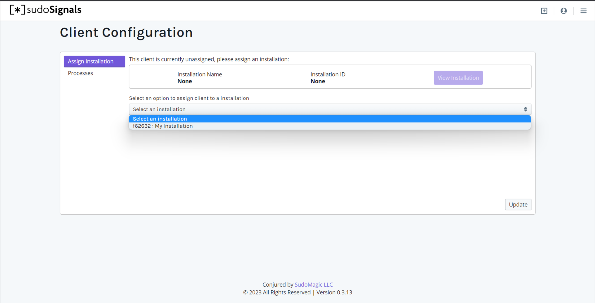

# Configure an Installation
{: .no_toc }

Table of contents
{: .no_toc .text-delta }

1. TOC
{:toc}
---

sudoSignals runs as a local process on your Windows computer, and is controlled via an online web Dashboard.
{: .fs-6 .fw-300 }

# Open the Dashboard

With an installation created, we can now configure how we'd like Signals to manage this machine. To get started, let's make sure that you have the Dashboard open in your browser — [dashboard.sudosignals.com](https://dashboard.sudosignals.com/)

# Start sudoSignals

To configure the installation we'll also need sudoSignals running. From the shortcut on your desktop or from the start menu, start sudoSignals.

# Configure from System Tray

Locate the sudoSignals icon in the system tray.

Right click on the system tray icon and select `Configuration`.

Alternatively, you can go to this page on your browser:  
`https://dashboard.sudosignals.com/client`

{: .important }
While we use a webform to capture the configuration data, this page communicates directly with the sudoSignals service to create a configuration YAML file. 

# Assign an Installation

On the Client Configuration page we can assign an installation by selecting the Assign Installation tab.

Assigning an installation will connect the sudoSignals dashboard to your local machine, this configuration step allows the sudoSignals client to communicate to the cloud about this specific computer resource. 

From the `Select an Installation` drop down, select which installation you'd like to assign to this computer. This process associates a Signals installation with your machine.

Once you've selected the installation to assign, click `Update` and this will update the configuration YAML file and restart Signals on your computer. 

{: .note }
Look for the green notification on the Client Configuration page to confirm that Signals has successfully updated its configuration. 

# Monitor Your Machine

If you only need to know if your installation machine is online, you can click the `View Installation` button, to be taken directly to the dashboard to start monitoring your computer. 

# Configure a Process
See the complete walkthrough on how to [Configure a Process](configureProcess).

# Configure Additional Processes | **optional**

sudoSignals can launch as many processes as your installation requires. Repeat this process as many times as you need to configure your installation. 

# Update

Now that we've gotten our installation configured, we can click `Update` in the bottom right hand corner of the Client Configuration page. This will restart Signals, and in turn start any applications you've specified in your installation's configuration. 

{: .warning }
It's important that you click `Update` so that your process settings will be saved to the sudoSignals configuration file. If you do not click `Update` you will need to repeat the configuration process.

# Head to the Dashboard

Back on the Dashboard you should now see that Signals is online.

