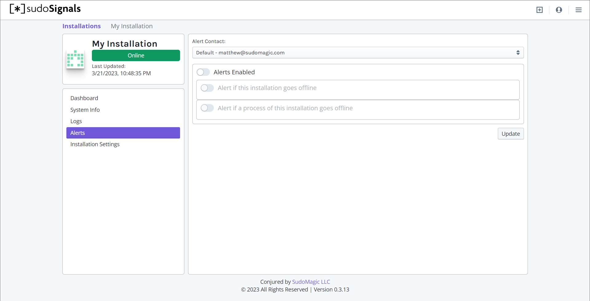

# Alerts
{: .no_toc }

Table of contents
{: .no_toc .text-delta }

1. TOC
{:toc}
---

sudoSignals can alert you via email or SMS when there are critical issues with your installation.
{: .fs-6 .fw-300 }

Signals can be configured to send an alert when:  
* Your installation goes offline. This may be due to a power outage, a compute restart, or an interruption in internet connectivity
* Your process goes offline. It's often valuable to know if your application has crashed, and sudoSignals can alert you if this happens.

{: .important }
When sudoSignals is set to Auto Restart your process, it will restart your application even if it crashes. When process alerts are enabled, you may still get a notification that your process has fallen offline so that you can investigate at your earliest convenience.

