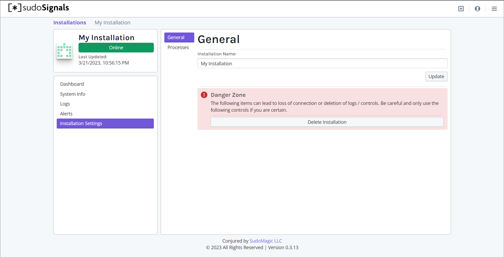
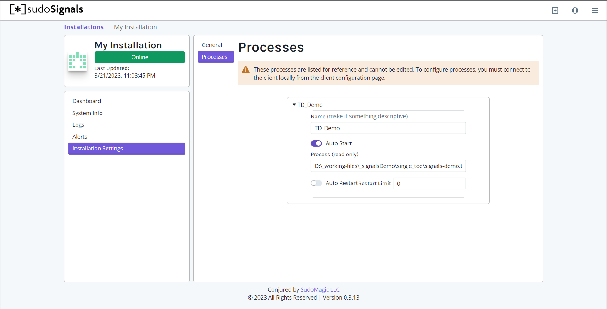

# Installation settings
{: .no_toc }

Table of contents
{: .no_toc .text-delta }

1. TOC
{:toc}
---

Installation settings includes the controls for updating details about your installation.
{: .fs-6 .fw-300 }

From this view you can change the name of your installation or delete it from your account.

You can additionally view a read-only version of the settings assigned to your remote processes by clicking on the Process tab.

