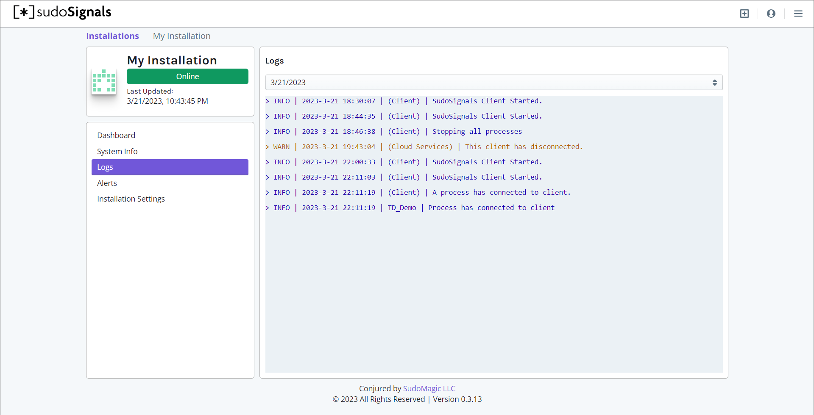

# Logs
{: .no_toc }

Table of contents
{: .no_toc .text-delta }

1. TOC
{:toc}
---

Logs provide realtime updates about the performance of your installation.
{: .fs-6 .fw-300 }

Both the sudoSignals client and your installation Processes can report log messages to the dashboard. Logs are string-based messages that are intended to be human readable. Logs have three different levels of importance:
* Info
* Warning
* Critical

Log messages are formatted as:  
`{log-level} | {time-stamp} | {reporting-process} | {log message}`

{: .warning }
The current character limit for logs is 255.