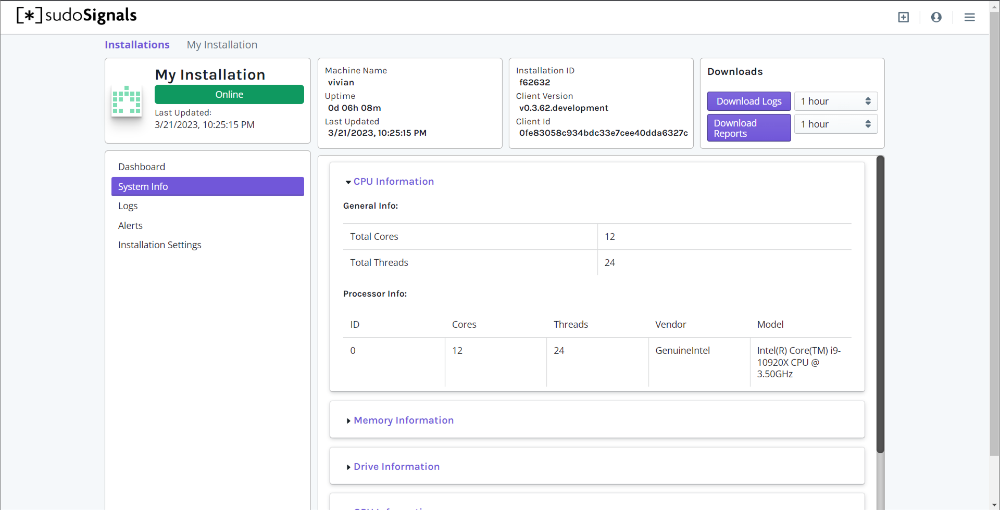

# System Info
{: .no_toc }

Table of contents
{: .no_toc .text-delta }

1. TOC
{:toc}
---

System Information contains detailed information about the remote installation's hardware.
{: .fs-6 .fw-300 }

These details can often be critical when troubleshooting performance issues, or determining if there may be a critical system issue. Hardware details in this view are reported directly from Windows [hardware discovery](https://pkg.go.dev/github.com/jaypipes/ghw). This view is comprised of:
* Machine Details  
* Installation Details
* Downloads
* Hardware Details
    * CPU Information
    * Memory Information
    * Drive Information
    * GPU Information
    * Network Information

# Machine Details

Machine name, uptime, and last updated gives an at-a-glance view of the hardware you're monitoring. `Uptime` provides critical information on time since the last Windows restart. `Last Updated` is the time stamp since the last heartbeat from the sudoSignals client to the web Dashboard.

# Installation Details

This section contains key details about your installation and sudoSignals including: Installation ID, Client Version, and Client Id.

{: .important }
If you ever experience issues with your installation, the support team at sudoSignals may ask you to provide information about the `Installation Id`, `Client Version`, or `Client Id` for better troubleshooting.

# Downloads

Logs and Reports from your installation can be downloaded for your offline review. These logs can be especially useful if you want to review data that exists outside of the graphed view on the dashboard. Note that this data is formatted as JSON. 

# Hardware Details

Hardware details provides vital insight into your local hardware. These details are broken into five categories:
* CPU Information
* Memory Information
* Drive Information
* GPU Information
* Network Information  

To see detailed information for each category, use the carrot to expand the section.