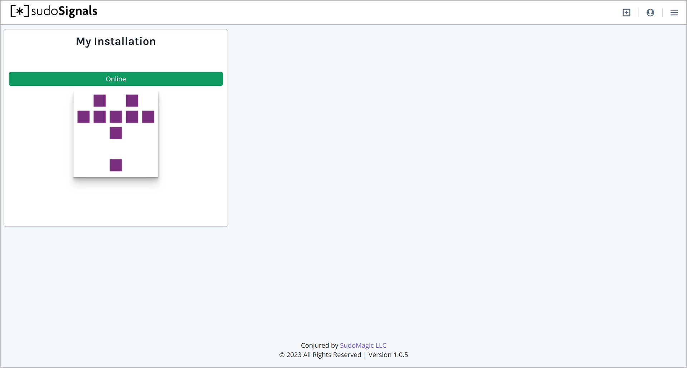

# Viewing Your Installation Stats
{: .no_toc }

Table of contents
{: .no_toc .text-delta }

1. TOC
{:toc}
---

On the Dashboard you should now see that Signals is online.
{: .fs-6 .fw-300 }

# Installation Card View

From the Card view you can see which installations are online, and their update and CPU Utilization statuses at a glance.

Clicking on your installation card will take you to the stats and control page for your installation. Where you can see additional details.

