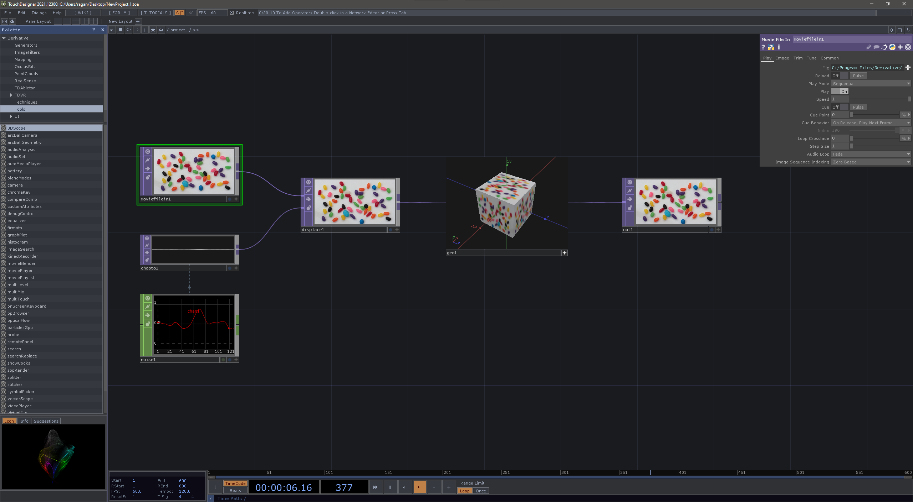
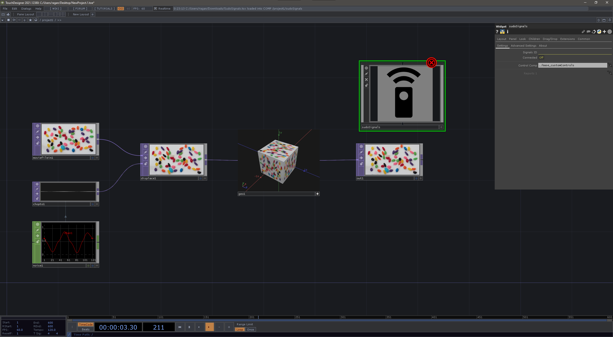
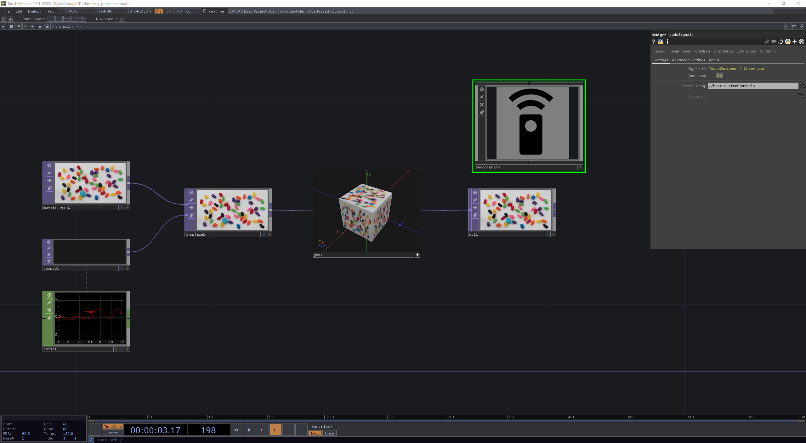
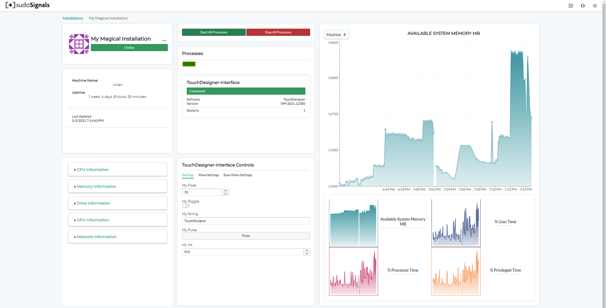
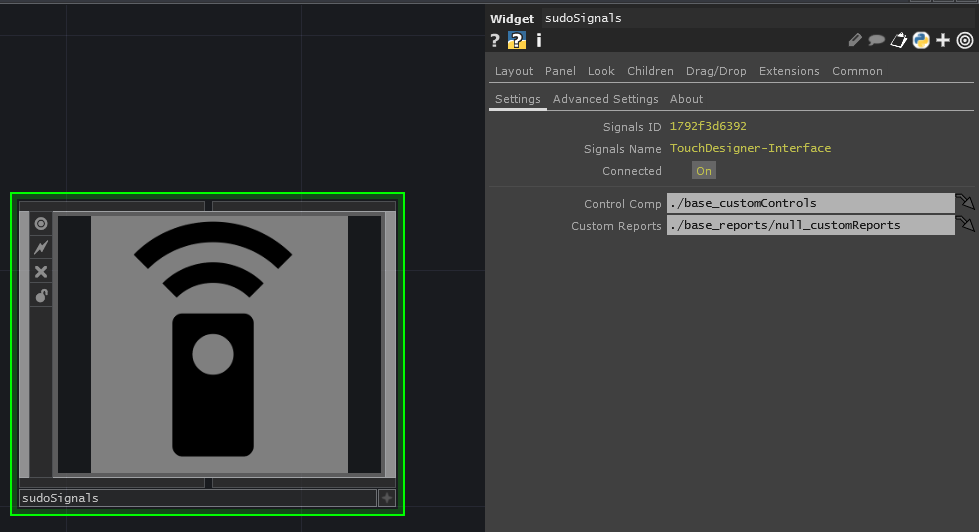
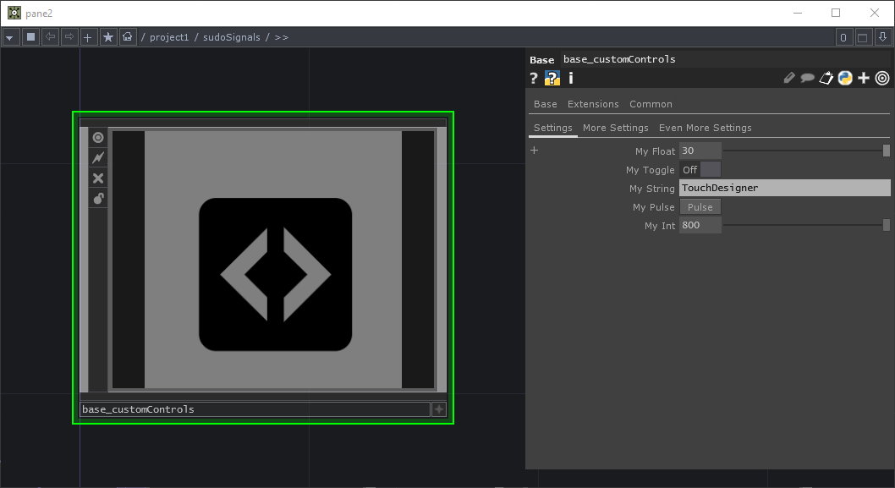
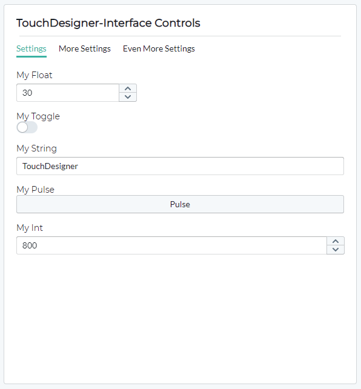
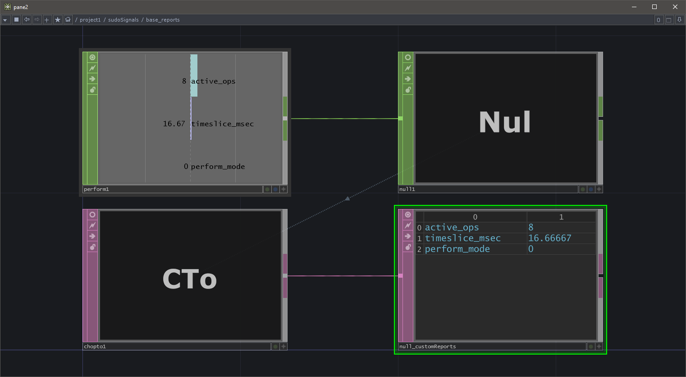
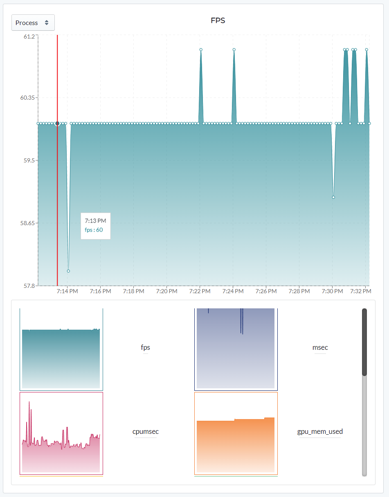

# Remote Control | SudoMagic Plugin
{: .no_toc }

Table of contents
{: .no_toc .text-delta }

1. TOC
{:toc}
---

Remotely controlling your TouchDesigner installation with the SudoMagic plugin is easy. We'll just need to download the Signals plugin, add it to our project file, and then launch our project with Signals.

* [**Download the TouchDesigner Plugin**](https://github.com/SudoMagicCode/sudoSignals_tdClient_releases//releases/latest/download/SudoSignals.tox)

# Download the Plugin

The Signals plugin can be downloaded from the [github page](https://github.com/SudoMagicCode/sudoSignals_tdClient_releases/releases). Optionally, you can download the sudoSignals TOX directly by [clicking here](https://github.com/SudoMagicCode/sudoSignals_tdClient_releases//releases/latest/download/SudoSignals.tox).

# Open your TouchDesigner Project

Open the TouchDesigner project you'd like to control. As an example, let's open a blank TouchDesigner project.

# Add the sudoSignals TOX

Next, drop the sudoSignals TOX you downloaded into your project.

If your project is not yet connected to Signals you should see an error on the sudoSignals TOX. Let's save our project and connect it to Signals.

# Save your Project file

Save your project file on your computer, and then close your project file. Make sure you know where it is located.

# Setup Signals to Launch this File

Head back to to the support pages for configuring sudoSignals, and make sure this project file is attached to your installation. This is step 6 and 7 on the [Configure Installation](https://docs.sudosignals.com/gettingStarted/configureInstallation.html) page.

# Launch your Project from Signals

Once Signals is configured to launch your file, your project should startup without any errors present.

# Check your Installation

Once the plugin has been added to your project, you should now see some additional metrics for your installation. 

Notice that in the center column of the Dashboard there is information about your controlled processes. This displays the assigned `Signals Name` along with the toolkit, and version that it's running.

## Controls
The TouchDesigner Plugin supports controlling parameters in TouchDesigner remotely from the dashboard. This is handled by pointing the `sudoSignals` plugin to an operator with custom parameters. 

A default operator with custom parameters is provided to help you get started.

{: .important }
To set your own controls, simply drag and drop an operator with custom parameters onto the `sudoSignals` TOX's parameter for `Control Comp`. Adding additional control handles is as easy as customizing the Comp and adding more controls.

You should see that these same parameters and page names are reflected on the Dashboard:

{: .note }
Controls for the `sudoSignals` plugin work both directions. Updating a custom parameter in TouchDesigner will be reflected on the cloud Dashboard, and changes on the Dashboard will push to the controlled TouchDesigner process. 

## Custom Reports and KPIs

In addition to custom controls, the `sudoSignals` plugin also supports sending custom reports and KPIs to the Dashboard. You'll see a custom parameter called `Custom Reports` on the plugin.

A default operator with custom reports is provided to help you get started.

{: .important }
Currently only numerical values are supported by the graphing tool kit in use. To ensure correct formatting for your reports make sure your table is formatted as two columns with labels in column 0 and values in column 1. Your table should **not** include a header.

KPIs are sent to the Signals service at a regular interval — these are then forwarded to the cloud. These reports can be seen in the graphs section of the Installation view by selecting the `Process` option from the drop down menu.

