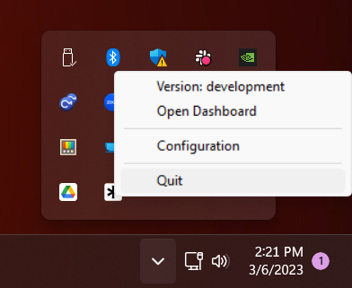
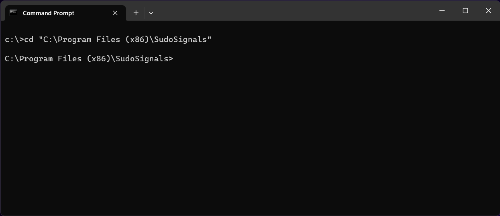
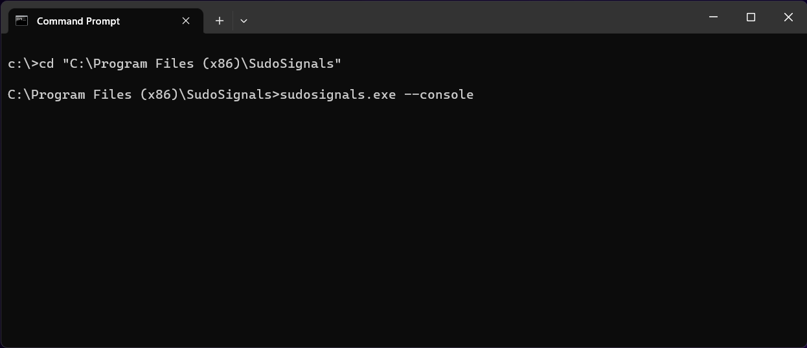
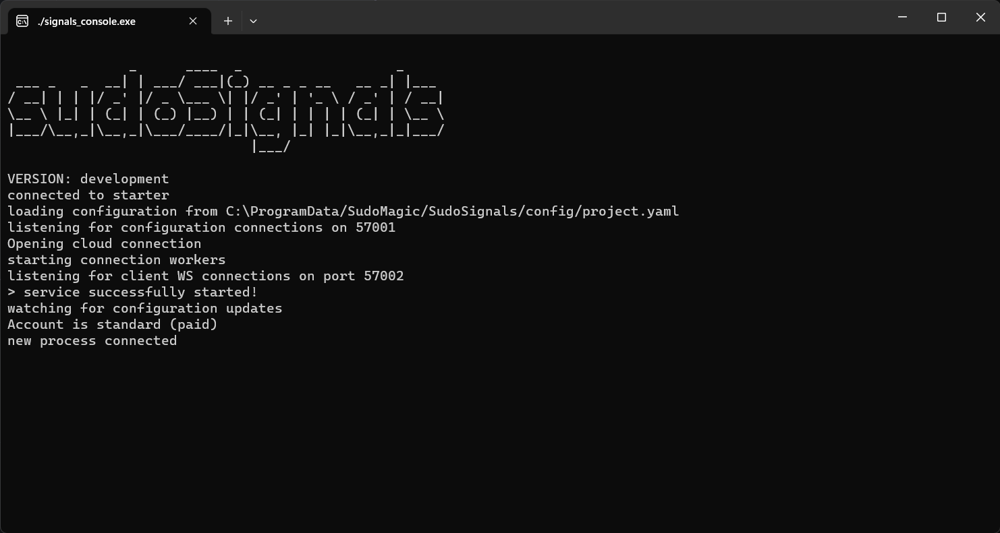

# Installation Location

{: .no_toc }

Table of contents
{: .no_toc .text-delta }

1. TOC
{:toc}
---

The sudoSignals client is installed on your computer in:  

`C:\Program Files (x86)\sudoSignals`  

In this director you will find all of the `.exe` files that are used to run sudoSignals.   

In rare occasions if you are debugging a performance issue you may need to run sudoSignals from the console. To do this:  

# Quit Signals and any controlled process  

Quit sudoSignals from the tray icon and close any open sudoSignals monitored process  
  

# Open a new terminal window
In a new terminal window move to the installation directory for sudoSignals  

`cd "C:\Program Files (x86)\sudoSignals"`  

  

# Use the --console flag
Start sudoSignals with the `--console` flag  

`sudosignals.exe --console`  

  

# Watch messages in the sudoSignals console

This will launch the sudoSignals client with an open console that displays any logged messages  

  

# Return to typical use

To close the console version of sudoSignals, quit sudoSignals from the tray icon  

