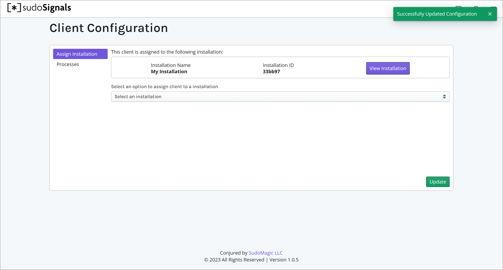
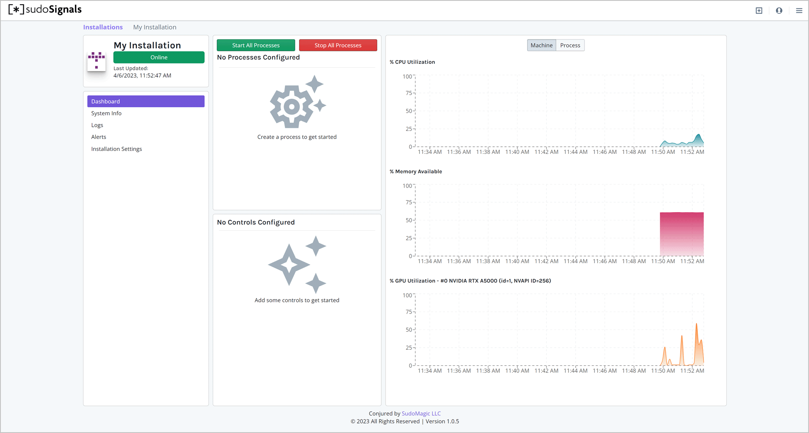
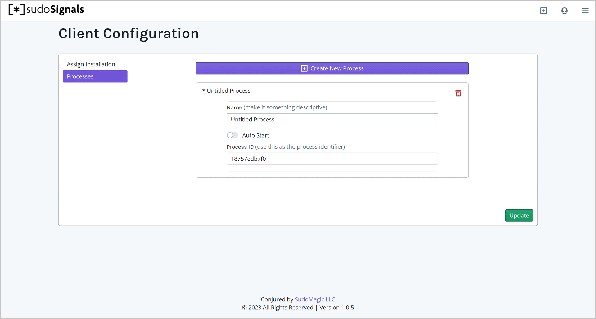
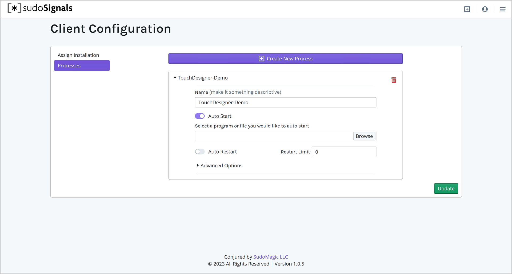
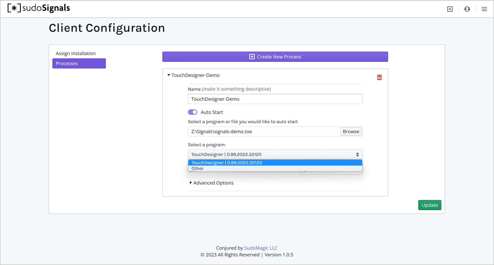
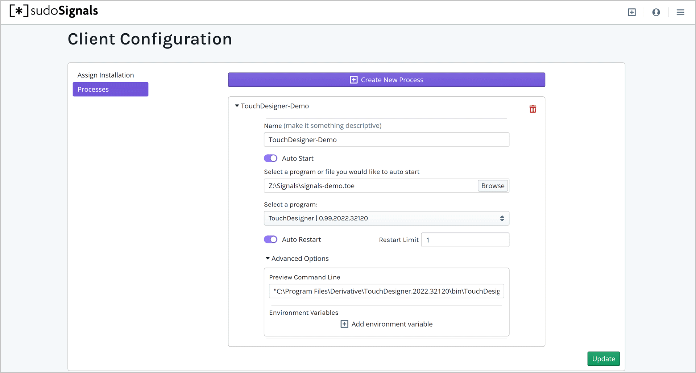
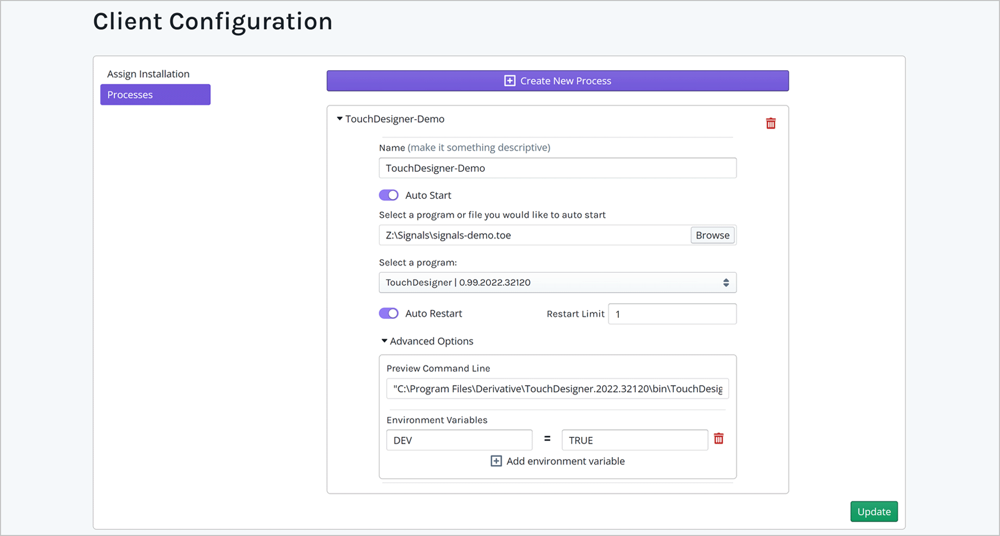
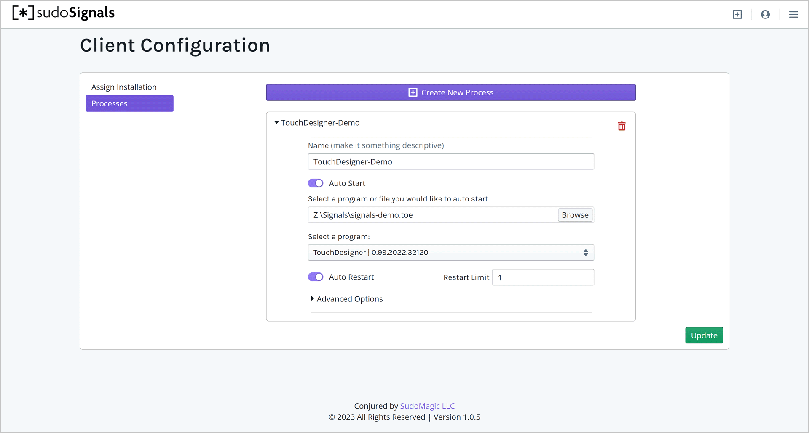

# Configure an Installation

sudoSignals runs as a local process on your Windows computer. In order for signals monitor applications and keep them alive, we need to install the local service to keep your installation looking its best.

## 1 Open the Dashboard

With an installation created, we can now set configure how we'd like signals to manage this machine. To get started, let's make sure that you have the dashboard open in your browser - [dashboard.sudosignals.com](https://dashboard.sudosignals.com/)


## 2 Start sudoSignals

To configure an installation we'll also need sudoSignals to be running. From the shortcut on the desktop, or from the start menu start sudoSignals.

## 3 Configure from System Tray

Locate the sudoSignals icon in the system tray.


Right click on the system tray icon and select **Configuration**.


Alternatively, you can just got to this page in your browser:  
`https://dashboard.sudosignals.com/configuration?p=10000`

```tip
While we use a webform to capture the configuration data, this page communicates directly with sudoSignals on port `10000` to create a configuration YAML file. 
```

## 4 Select Installation to Configure

On the installation page select which installation you would like to configure from the installation drop down menu. This process associates a signals installation with a your server.


Click **Update** on the bottom of the page - this will update the configuration YAML file and restart signals on your computer. 



## 5 Goto the Startup Page

Navigate to the Start up tab on the Configuration page. On this page we'll configure signals to start a application. 

In some cases you may want windows to run a batch file before or after your application starts up. Signals provides the option to run a batch file for either or both of thesze cases. 



## 6 Create a New Process

```tip
Applications that we control and monitor through sudoSignals are refereed to as a `process`. 
```

In most cases we want to create a new process that Signals will monitor. To do this, let's start by clicking `Create New Process`. 


This creates a new process entry below:



You can open all of the parameters for our process by using the small carrot to the left of the process name.



### Assign a Process ID

The `process-id` is the unique name you'd like to associate with your process. You might choose to name this after the tookit you're using, or based on the work a given application is responsible for doing. 

```warning
It is important, however, that this name is unique. Each process managed by Signals should have a unique name. 
```



### Select a Program to Start

Next we'll select the application that Signals is going to start. Click the **Browse** button to select an application that Signals will start and stop. 



For example, if you are going to use sudoSignals to run TouchDesigner, you'll want to select **Browse** and navigate to the `TouchDesigner.exe` application.



### Set Command Arguments

```tip
Setting arguments is an optional field. Applications often accept command line arguments for operations ranging from opening files, to opening with specific settings. Signals allows command line arguments to be passed through to the application. In most cases you'll likely use this feature to specify which file you'd like  your application to run.
```

If you have a specific file you'd like to run with your selected program, in the Arguments field paste the path to your target file. 


For example, if I wanted to run a specific project file with TouchDesigner I would enter the path to that file here.



### Set Auto Restart Count

```tip
Signals can be configured to attempt to restart an application a fixed number of times, or to always attempt to keep an application running. 
```

If you'd like sudoSignals to keep your application running, first toggle the **Auto Restart** parameter to the on position. 


To have Signals keep the application always running, leave the Restart Limit at 0. If you would only like Signals to restart an application a specific number of times, enter that number in the Restart Limit field. 

### Set Controlled Status

```tip
Controlled processes communicate through sudoSignals to the web. 
```

If you know that your application is going to have an exposed parameter set that will need to talk to the web dashboard, set the toggle for **Controlled** to the on position. If you only need signals to start your application, and it doesn't need to talk with the dashboard directly, you can leave this toggle in the off position.


## 7 Update

Now that we've gotten our installation configured, we can click **Update**. This will restart Signals, and in turn start any applications you've specified in your installation's configuration. 


