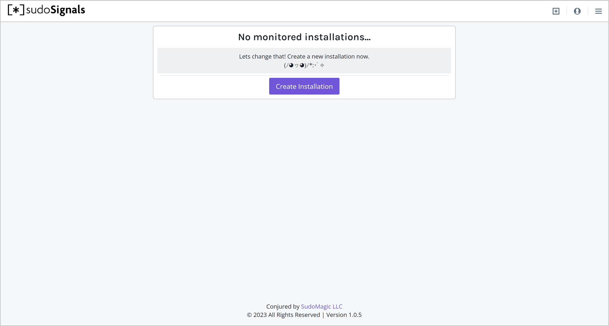
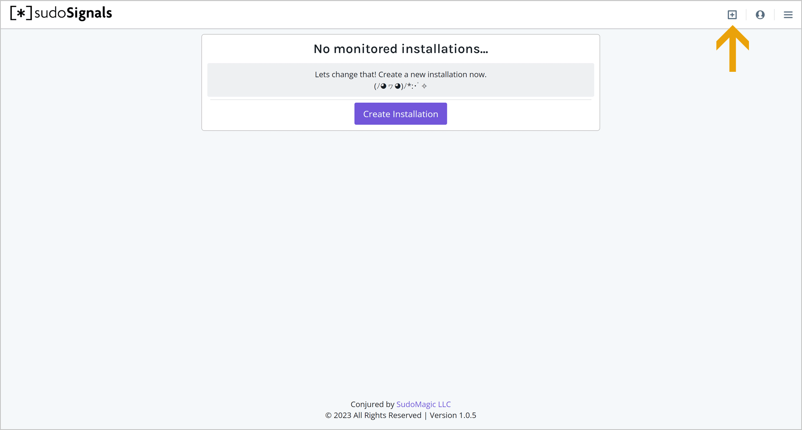
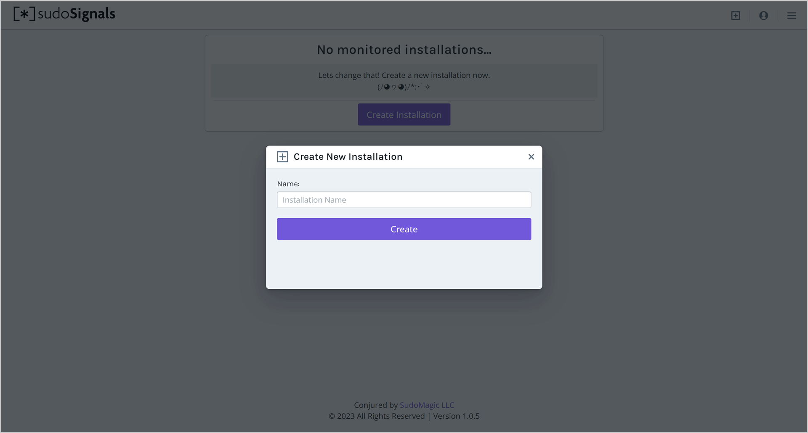
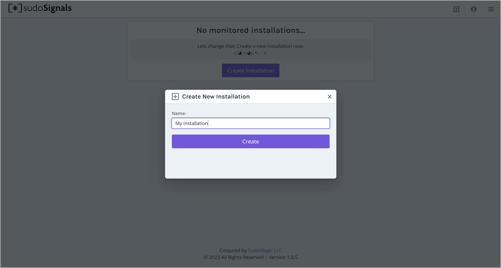

# Create an Installation

sudoSignals can be used to monitor, control, and restart applications. We treat a computer as an `installation` which can manage and control multiple applications. Installations have a unique product-id which is used to link your computer and all of its operation to the web dashboard. 

Let's get started by creating an installation. 

## 1 Open the sudoSignals Dashboard

We can start by heading to the sudoSignals dashboard at [dashboard.sudosignals.com](https://dashboard.sudosignals.com/)

## 2 Create an Installation

If you're creating your first installation you can click **Get Started**. 

If you already have an installation, and want to add another click the plus icon in the upper right to create a new installation.

## 3 Name Your Installation

When the Create New Installation dialogue opens you can enter a descriptive name for your installation and the click **Create It**.

After creating your installation you'll be directed back to your dashboard where you can see the a card with all of the at-a-glance details for your installation.

