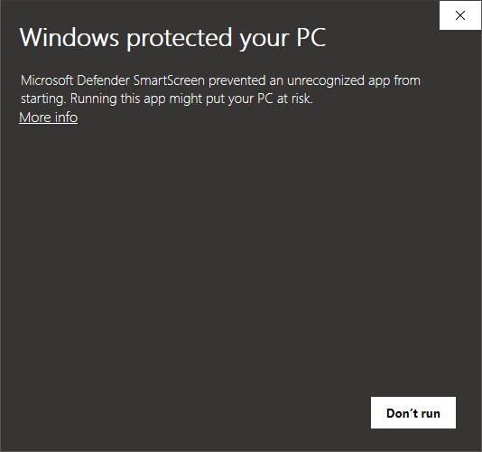
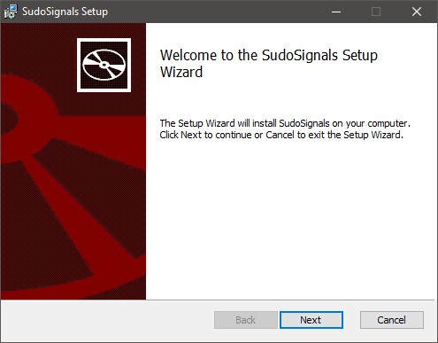
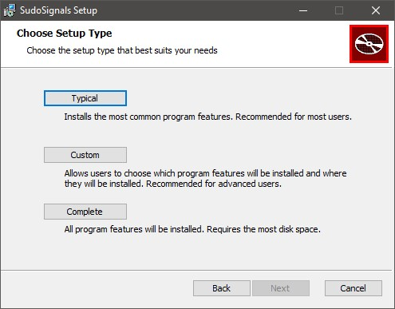
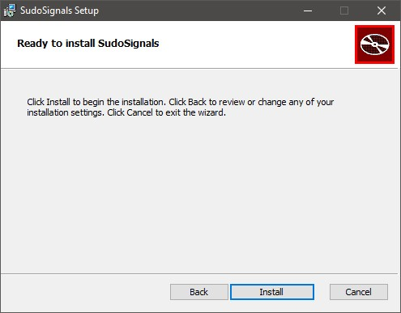
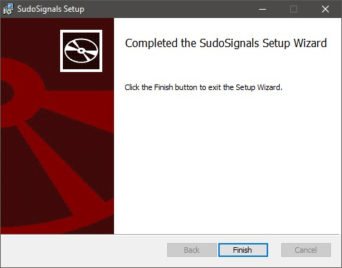
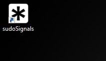

# Installing sudoSignals

sudoSignals runs as a local process on your Windows computer. In order for signals monitor applications and keep them alive, we need to install the local service to keep your installation looking its best.

## 1 Download sudoSignals

In your download the [latest sudoSignals installer](https://github.com/SudoMagicCode/sudoSignals_releases/releases/latest/download/SudoSignals_Installer.msi).


If you need an older version of signals, you can see all of the [sudoSignals releases here](https://github.com/SudoMagicCode/sudoSignals_releases/releases).

## 2 Run the Installer
After downloading the installer it's time to get sudoSignals up and running. Start by double clicking the installer.

### Windows Protection

```note
We're working on getting our windows application publisher certificate. In the meantime, you'll there's an extra step getting the installer working. 
```

You should see a warning from windows about an application from an unknown publisher. 



First click the link for more info, and then **run anyway**


### Welcome

The welcome screen is were the installer starts, begin the installation process by clicking next.



### Accept the EULA

Signals has an end user licensing agreement, agree to the license agreement and click next.


### Select Installation Type

There are three different installation types for Signals. If you'd like to use our recommend settings, select **Typical** - this will install Signals for you automatically. If you'd like to select where signals is installed select **Custom**. Right now **Complete** has all of the same installation elements as **Typical**, in future releases we're working on having some more advanced features for the user to select.



### Install

Next let's click `Install` to get the Signals service installed on your computer.




### Complete the Installation

Finally, you can complete the installation by clicking on `Finish`




## 3 Start sudoSignals

You should now have a sudoSignals shortcut on your desktop, and in your start menu. 



Once you start Signals, you should see a system tray icon.

