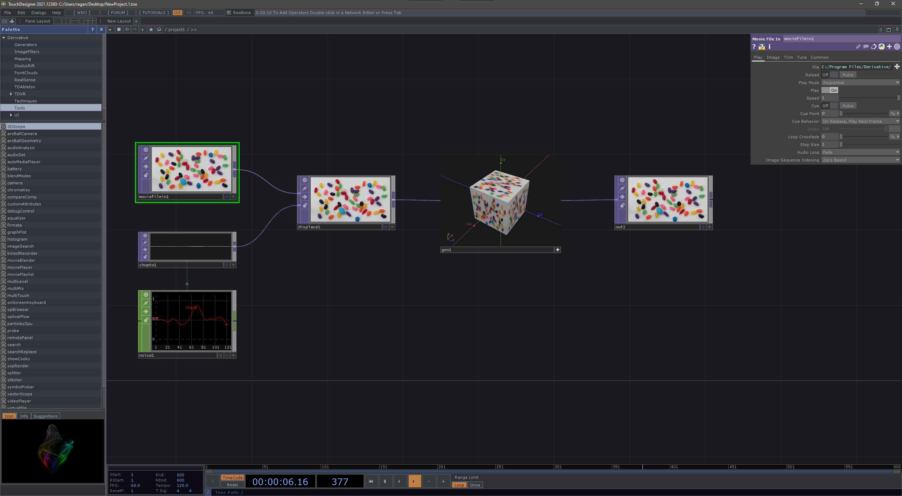
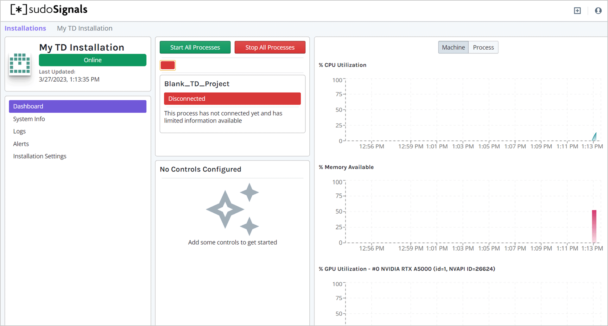
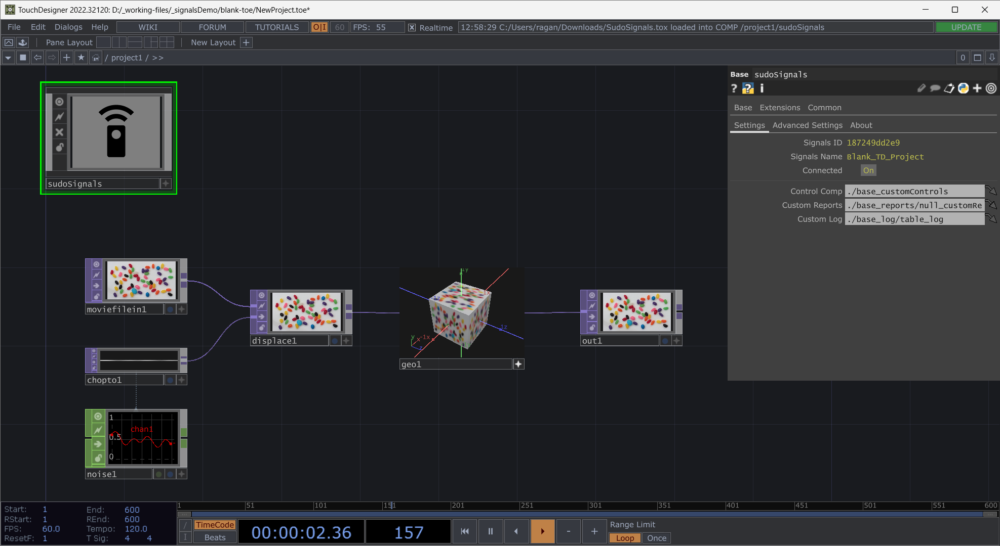

# Remote Control | SudoMagic Plugin

Remotely controlling your TouchDesigner installation with the SudoMagic plugin is easy. We'll first need to download the Signals plugin, add it to our project file, and then launch our project with signals.

## Download the Plugin

The Signals plugin can be downloaded from the [github page](https://github.com/SudoMagicCode/sudoSignals_tdClient_releases/releases). Optionally, you can download the sudoSignals TOX directly by [clicking here](https://github.com/SudoMagicCode/sudoSignals_tdClient_releases//releases/latest/download/SudoSignals.tox).

## Open your TouchDesigner Project

Open the TouchDesigner project you'd like to control. As an example, let's open a blank TouchDesigner project.

## Add the sudoSignals TOX

Next drop the sudoSignals TOX you downloaded into your project.

If your project is not yet connected to signals you should see an error on the sudoSignals TOX. Let's save our project and connect it to signals.

## Save your Project file

Save your project file on your computer, and then close your project file. Make sure you know where this is located.

## Setup Signals to Launch this File

Head back to to the support pages for configuring sudoSignals, and make sure this project file is attached to your installation. This is step 6 and 7 on the [Configure Installation](https://docs.sudosignals.com/gettingStarted/configureInstallation.html) page.

## Launch your Project from Signals

Once Signals is configured to launch your file, your project should startup without any errors present.

