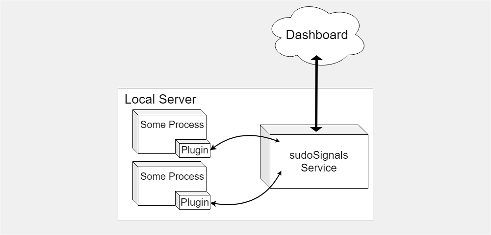

# Plugin API

Plugins use an API for communicating with the local sudoSignals client. While there are some existing plugins for sudoSignals, you're welcome to develop your own tools to better suite your organizations' needs.

sudoSignals has an open websocket API for controlling and reporting on process behavior. The local sudoSignals client is responsible for starting processes on the local server, reporting system diagnostic information, and relaying information and control settings between the dashboard and the plugins embedded in the monitored processes.  

{: .fs-6 .fw-300 }
