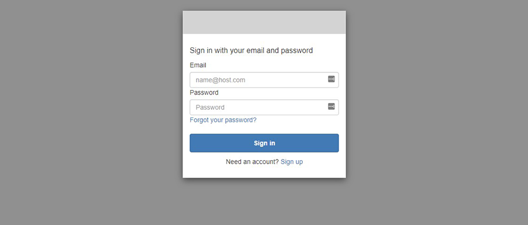
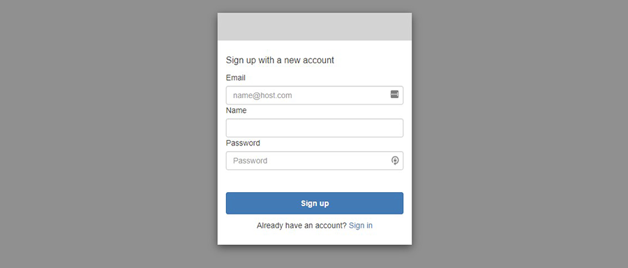
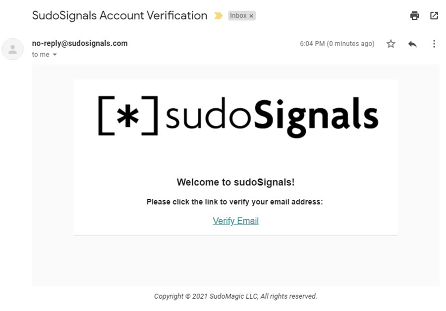
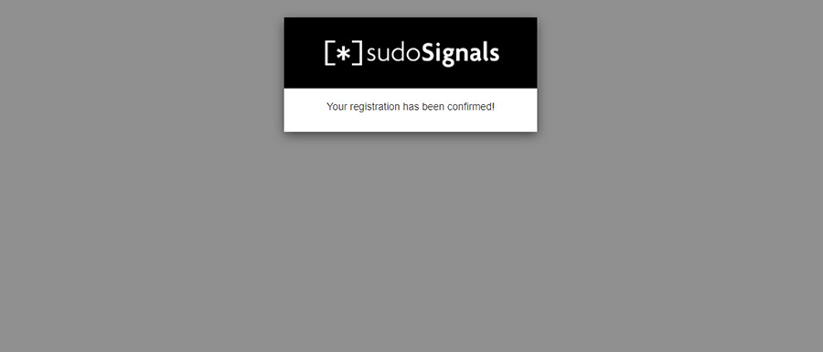
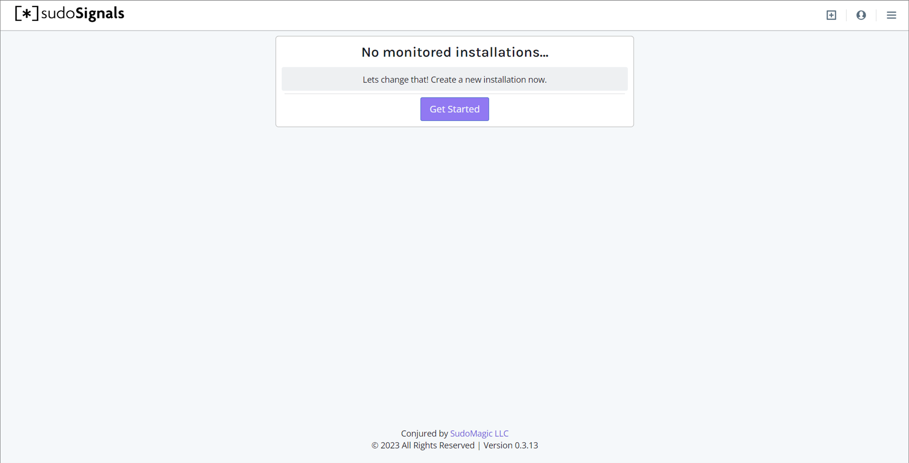

# Create Your sudoSignals Account
{: .no_toc }

## Table of contents
{: .no_toc .text-delta }

1. TOC
{:toc}
---

To control your installations remotely you'll need to have a sudoSignals account. The steps below will walk you through creating a Signals account.

## 1. Open your Browser
In your browser head to [dashboard.sudosignals.com](https://dashboard.sudosignals.com/). You should see a page that looks like:

## 2. Create Your Account

Click the link to sign up at the bottom of the form.

Next you'll see a page to enter your email address, name, and create a password.

## 3. Verify Your Email

After clicking *Sign up* you'll be prompted to verify your email.

Check your inbox for an email from sudoSignals to verify your email address.

Finally, click the link to confirm your account.

## 4. Login to the Dashboard

You should now be able to log in on the sudoSignals dashboard.

